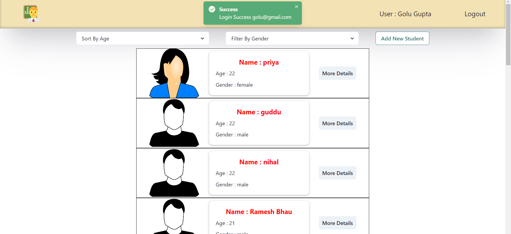
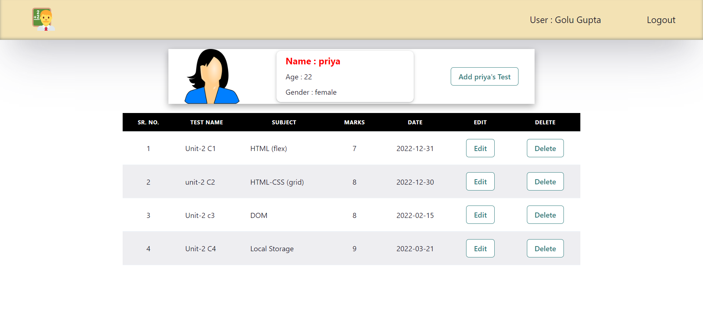

# Teacher's App

## Helps to manage student's data.

## Features :-

### Teacher can sign up to the app

If teacher do not have account, he will not be able to login to the app. To sign up to the app, teacher needs to feel one form, then he will get the toast messege after clicking on sign up button. after successful sign up, he will be redirected to the login page.
    
### Teacher Can Sign in to the app

To access anything inside the app, teacher need to login first, all routes are protected routes. If user wants to access any route without login, he will be automatically redirected to the login page. On the login page, user can login with email id and password, which he/she provided during signup.

### Teacher Will be able to see all the students.

After login user (teacher) will be able to see all students. 

### Filter by gender and sort by age option is also available.

for convinience of user, filter by gender and sort by age option has been provided to the user.

### Teacher can add new student.

User can add new student to the app, by using "ADD NEW STUDENT" option, provided on the top of the page.

### Single Student :-

On the students page, more details option has been provided with each students card. after clicking on it, user will be redirected to the page of that perticular student, where he will be able to see all the tests given by the student, also user can add tests to the list and delete tests from the list.

## Login Page 

## Sign Up Page :- 

## Students Page :-

## Tests Details (different for each student):-

