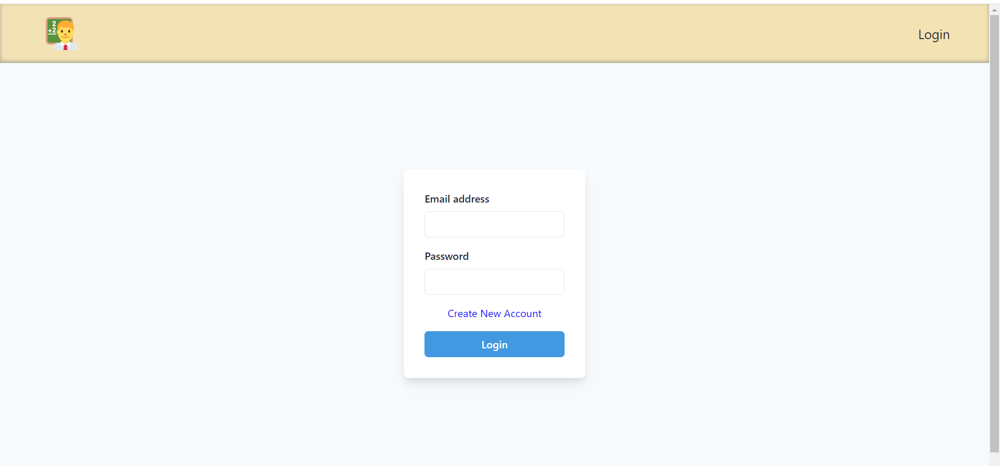
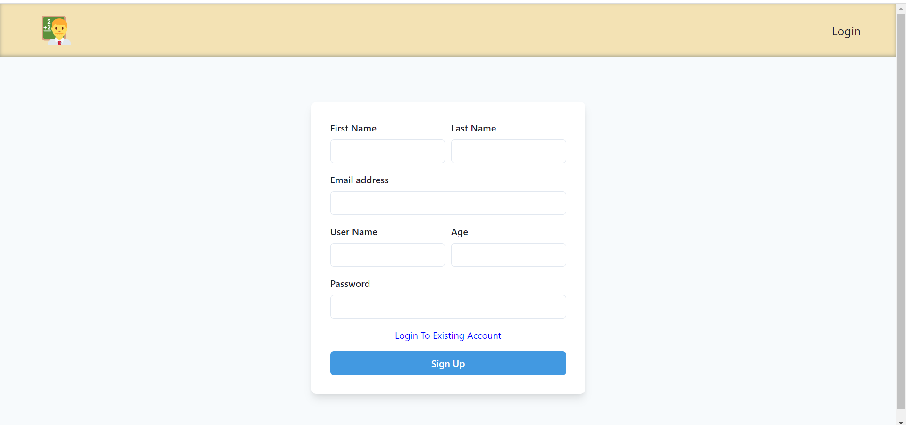

# Teacher's App

## Helps to manage student's data.

## Features :-

### Teacher can sign up to the app
    If teacher do not have account, he will not be able to login to the app. To sign up to the app, 
    teacher needs to feel one form, then he will get the toast messege after clicking on sign up button.
    
    after successful sign up, he will be redirected to the login page.
    
### Teacher Can Sign in to the app
### Teacher Will be able to see all the students.
### Filter by gender and sort by age option is also available.
### Teacher can add new student.
### after clicking on more details, teacher can get all the test of perticular student.

## Login Page 

## Sign Up Page :- 

## Students Page :-

## Tests Details (different for each student):-

